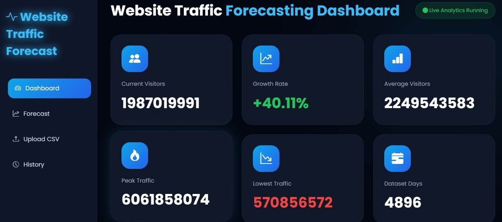

# TrafficVision AI 🚀

AI-powered Website Traffic Forecasting Platform using:

- Flask 
- Scikit-learn
- Plotly
- Pandas
- SQLite
- Bootstrap

## Features 🔮

- AI Traffic Forecasting
- Random Forest + Linear Regression
- Interactive Analytics Dashboard
- CSV Upload
- Prediction History
- Export Forecast
- Responsive Dark UI
- AI Charts & Insights

---
## DASHBOARD 📈

----
# Installation 👾

## 1. Create Virtual Environment

```bash
python -m venv venv
